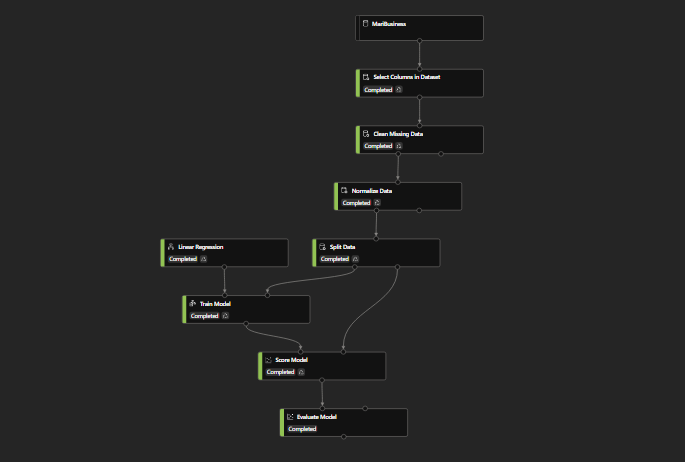
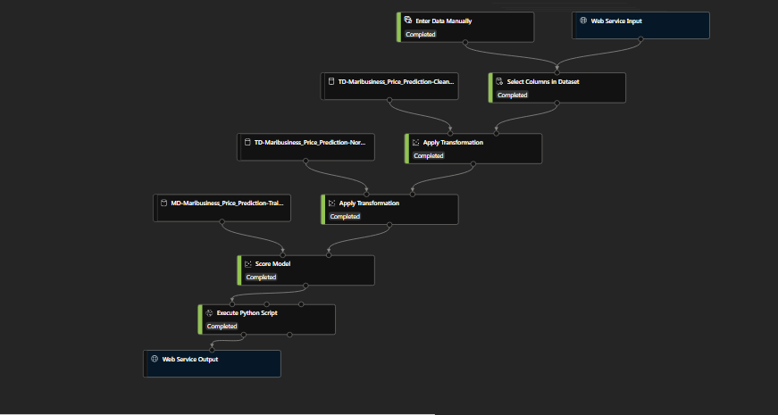

# Dokumentasi Capstone Project MariBisnis
### Video Dokumentasi
https://web.microsoftstream.com/video/8057fe28-f666-45ca-bd4b-0d23ecd50bb7

### Permasalahan
MariBisnis ingin mengetahui trend bisnis dari penjualan rumah yang ada di Amerika 
Serikat. Harapannya, MariBisnis dapat untuk memprediksi harga suatu rumah dan 
melalukan pemetaan terhadap sebaran data yang ada.

### Tahapan Pengembangan
1. Melakukan <i>Pre-processing</i> terhadap dataset [MariBisnis](Dataset/MariBisnis.csv)
2. Membuat model dataset Tabular pada Azure Machine Learning Studio
3. Membuat Training pipeline untuk melatih model dataset menggunakan Linear Regression Modul
4. Membuat Inference pipeline untuk memproses data baru yang di inputkan dari Web Aplikasi
5. Membuat Report menggunakan Power BI dengan model dataset yang telah dilatih
6. Membuat Dashboard berbasis Desktop

# Azure ML Pipeline Models
## Training Pipeline

## Real-time Inference Pipeline

# Power BI Dashboard

